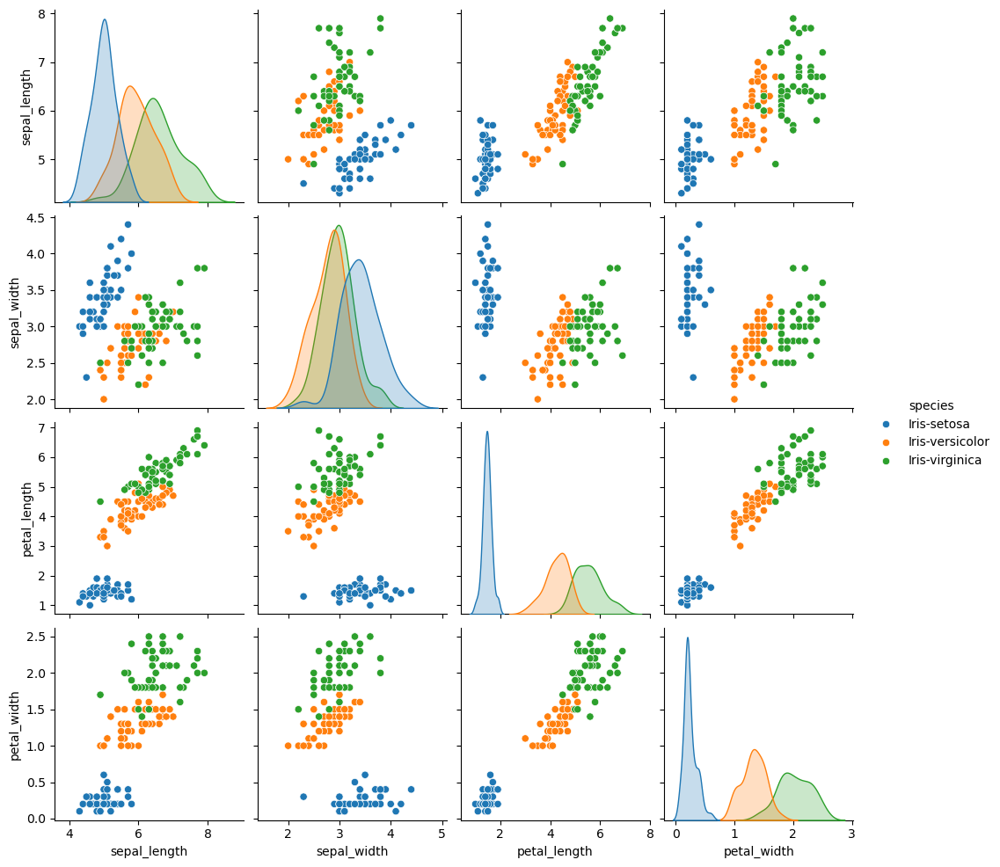

# Iris-Species-Multiclass-Classifier

**Objective**
This project aims to develop a PyTorch-based multiclass classification model to accurately classify Iris species.

**Dataset Description**
The dataset of iris-species consists of:  
4 features: sepal_length, sepal_width, petal_length, and petal_width. (they are all numerical) 
3 classes: Iris-setosa, Iris-versicolor , and Iris-virginica.  
Total samples: 150  
It's a balanced dataset as well.  
 
This is the pairplot of the dataset  

**Steps to run the code**
1. Download the ipynb file and the dataset file.  
2. Upload the notebook on Colab then upload the dataset.  
3. Run the whole code to see the results by yourself.  

**Dependencies**
-Numpy, Pandas,seaborn, Tensorflow, matplotlib, and sklearn

